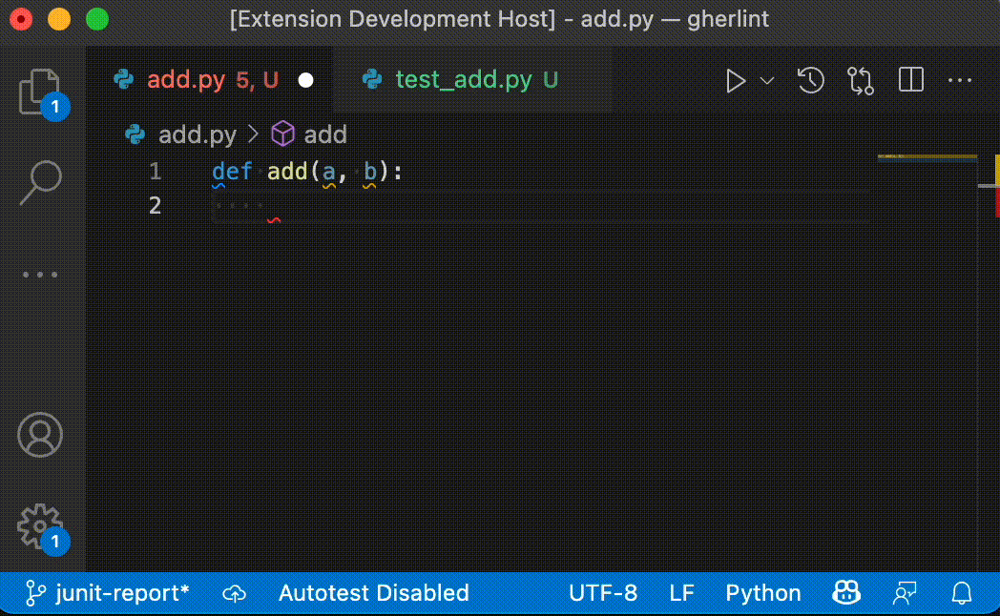

# Test Files On Save

Tired of switching to the test explorer to run test while working TDD style?
This extension will automatically run them for you when you save a file!

## Features

* Language independent - command to run tests can be set through ``settings.json``
* Can be enabled/disabled through ``settings.json`` or by clicking the status bar icon
* Runs discretely in the background - no annoying popups, only red or green status bar icon displaying last test result
* Exit codes can be mapped to status icons for passing, failed, and errored tests
* Allows using VSCode predefined variables

## Demo

## Requirements

Test On Save runs on VScode 1.62.0 and above.

## Extension Settings

This extension contributes the following settings:

* `testOnSave.enabled`: Enable/disable this extension
* `testOnSave.testCommands`: Commands to run tests for each language Id. Any non-zero exit code is treated as failing tests.
* `testOnSave.languageId`: Only trigger tests when a file of this language is saved. Set to "any" to always run tests after saving.
* `testOnSave.exitCodePass`: Exit code(s) that are considered as a passing test suite. Defaults to 0.
* `testOnSave.exitCodeFail`: Exit code(s) that are considered as a failing test suite. Defaults to non-zero.
* `testOnSave.exitCodeError`: Exit code(s) that are considered as errors when running the tests. Not used by default.

## Predefined Variables in test commands:

The following predefined variables are supported:
- ${workspaceFolder} - the path of the folder opened in VS Code
- ${workspaceFolderBasename} - the name of the folder opened in VS Code without any slashes (/)
- ${file} - the current opened file
- ${fileWorkspaceFolder} - the current opened file's workspace folder
- ${relativeFile} - the current opened file relative to workspaceFolder
- ${relativeFileDirname} - the current opened file's dirname relative to workspaceFolder
- ${fileBasename} - the current opened file's basename
- ${fileBasenameNoExtension} - the current opened file's basename with no file extension
- ${fileExtname} - the current opened file's extension
- ${fileDirname} - the current opened file's folder path
- ${fileDirnameBasename} - the current opened file's folder name
- ${env:NAME} - reference environment variables through the ${env:Name} syntax

## Known Issues

No issues so far

## Release Notes

# Test Files On Save derived from the extension [andifin.testonsave](https://marketplace.visualstudio.com/items/andifin.testonsave)

See the [changelog](https://marketplace.visualstudio.com/items/andifin.testonsave/changelog) for details.

## Attributions

Icons made by <a href="https://www.flaticon.com/authors/maxim-basinski-premium" title="Maxim Basinski Premium">Maxim Basinski Premium</a> from <a href="https://www.flaticon.com/" title="Flaticon">www.flaticon.com</a>
